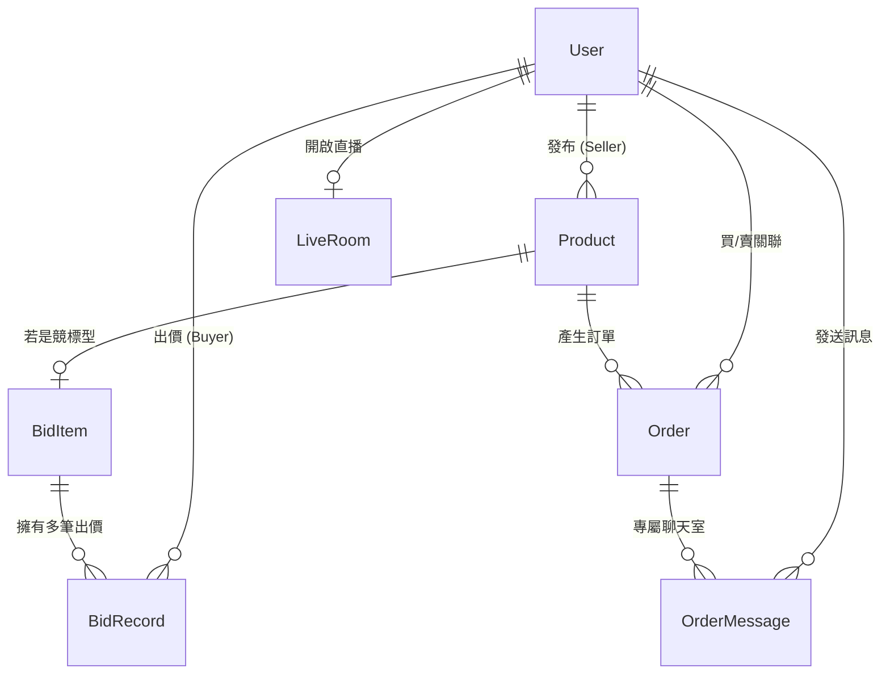

# 🐾 寵物live - Web 前後端系統詳細規格書 (v4.0 擴充版)

本文件為 **PetLive** 系統的最高指導原則。初期開發重心將全面放在「Web 前後端與系統基建」，以確保底層邏輯穩健、資料庫具備擴充性，並透過網頁端完美避開 APP 平台的 30% 抽成。

---

## 🗄️ 一、 詳細資料庫綱要 (Data Structure & ERD)

本系統基於 **Python Flask** 與 **PostgreSQL (Cloud SQL)**，並使用 `SQLAlchemy` 作為 ORM 框架。以下為核心實體關聯設計。

### 1. User (會員)
買賣家共用帳號。使用第三方登入時不需密碼。
| 欄位名稱 | 型別設定 | 說明與關聯 |
| :--- | :--- | :--- |
| `id` | UUID (PK) | 唯一識別碼 |
| `email` | String (Unique) | 登入帳號或第三方綁定信箱 |
| `password_hash` | String (Nullable) | 使用者密碼加密 (若為 Google/LINE 登入則為 NULL) |
| `auth_provider` | Enum | `LOCAL`, `GOOGLE`, `LINE` |
| `role` | Enum | `BUYER` (買家), `SELLER` (賣家), `ADMIN` (管理員) |
| `credit_score` | Int | 信用分數，預設 `100`，滿分 `200`。低於門檻將限制出價權限。 |
| `seller_subscription_end`| DateTime (Nullable) | 賣家訂閱到期日。過期後自動降級權限。 |
| `created_at` | DateTime | 帳號建立時間 |

### 2. Product (商品)
賣家上架商品主檔。上架初期需經過人工審核。
| 欄位名稱 | 型別設定 | 說明與關聯 |
| :--- | :--- | :--- |
| `id` | UUID (PK) | 商品編號 |
| `seller_id` | UUID (FK) | 關聯 `User.id` |
| `title` | String | 商品標題 (如：長戟大兜蟲 150mm) |
| `description` | Text | 商品圖文描述 |
| `type` | Enum | `BUY_NOW` (直購), `BID` (競標) |
| `images` | Array[String] | 存放於 GCS 的圖片 URL 陣列 |
| `status` | Enum | `PENDING_REVIEW` (待審), `ACTIVE` (上架), `SOLD` (已售) |
| `stock` | Int | 直購庫存數量 (若是競標通常為 1) |

### 3. BidItem (競標設定)
僅有 `type` 為 `BID` 的商品才會有此表關聯。
| 欄位名稱 | 型別設定 | 說明與關聯 |
| :--- | :--- | :--- |
| `id` | UUID (PK) | 競標設定編號 |
| `product_id` | UUID (FK) | 關聯 `Product.id` |
| `start_price` | Decimal | 起標價 |
| `current_price` | Decimal | 當前最高價 (透過 Redis 鎖定更新) |
| `min_increment` | Decimal | 每次最少加價金額 (例如 50 元) |
| `end_time` | DateTime | 預定結標時間 |

### 4. BidRecord (出價紀錄)
透過 Socket.io 接收後，經由 Celery 非同步成功寫入的歷史明細。
| 欄位名稱 | 型別設定 | 說明與關聯 |
| :--- | :--- | :--- |
| `id` | UUID (PK) | 出價紀錄編號 |
| `bid_item_id` | UUID (FK) | 關聯 `BidItem.id` |
| `user_id` | UUID (FK) | 關聯出價者 `User.id` |
| `bid_amount` | Decimal | 該次出價金額 |
| `created_at` | DateTime | 伺服器接收到出價的精確時間 |

### 5. Order (訂單)
結帳或得標後產生的最終訂單。
| 欄位名稱 | 型別設定 | 說明與關聯 |
| :--- | :--- | :--- |
| `id` | UUID (PK) | 訂單編號 |
| `buyer_id` | UUID (FK) | 買方 `User.id` |
| `seller_id` | UUID (FK) | 賣方 `User.id` |
| `total_amount` | Decimal | 最終結帳金額 (得標價或直購總價) |
| `logistics_status` | Enum | `PENDING` (待處理), `SHIPPED` (已出貨), `COMPLETED` (完成) |
| `tracking_number` | String (Nullable) | 賣家手動填寫的物流單號 (7-11/黑貓) |
| `is_abandoned` | Boolean | 預設 `False`。若為 `True` 代表惡意棄標，將觸發扣分懲罰。 |

### 6. OrderMessage (得標聊天)
得標後專屬的 1v1 私密聊天室。
| 欄位名稱 | 型別設定 | 說明與關聯 |
| :--- | :--- | :--- |
| `id` | UUID (PK) | 訊息編號 |
| `order_id` | UUID (FK) | 關聯 `Order.id` (以此作為房間 ID) |
| `sender_id` | UUID (FK) | 發送者 `User.id` (買方或賣方) |
| `message_text` | Text | 訊息文字內容 |
| `created_at` | DateTime | 發送時間 |

### 7. LiveRoom (直播間)
紀錄 SRS 伺服器的串流狀態。
| 欄位名稱 | 型別設定 | 說明與關聯 |
| :--- | :--- | :--- |
| `id` | UUID (PK) | 直播間編號 |
| `seller_id` | UUID (FK) | 直播主 `User.id` |
| `title` | String | 直播標題 |
| `stream_key` | String | 串流金鑰 (OBS 推流使用) |
| `status` | Enum | `IDLE` (未開播), `LIVE` (直播中), `ENDED` (已結束) |
| `max_viewers` | Int | 硬性限制最高 50 人在線 |

---

## 🖥️ 二、 Web 前端頁面與組件規劃 (React / Next.js)

### 1. 首頁與公共頁面 (Public Pages)
- **首頁 (Home `/`)**
  - **Hero Banner**: 輪播圖（展示強打活動或熱門賣家）。
  - **Live Now 區塊**: 橫向滑動列表，展示進行中的直播間（最多顯示 10 間）。需顯示封面圖與醒目的「LIVE」紅底白字動態標籤。
  - **熱門競標區塊**: 顯示即將結標的高價甲蟲/爬蟲，包含動態倒數計時器與當前最高價。
  - **最新直購區塊**: 顯示一般耗材（如：保濕介質、果凍）。
- **登入/註冊頁面 (Auth `/login`)**
  - **Google 快速登入按鈕** (OAuth 2.0)
  - **LINE 快速登入按鈕** (LINE Login V2)
  - 傳統 Email 與密碼輸入框

### 2. 商品與交易頁面 (Shopping & Bidding)
- **商品列表頁 (Catalog `/products`)**
  - **左側篩選器**：寵物種類（甲蟲、爬蟲、用品）、交易模式（直購、競標）。
  - **商品卡片網格**：RWD 響應式 Grid View。
- **商品詳情與競標頁 (Product Detail `/product/[id]`)**
  - **商品資訊**: 圖片輪播、產地、學名、尺寸、賣家接受之物流方式（7-11、黑貓、空軍一號）。
  - **直購模式**: 數量選擇器、「加入購物車」與「立即購買」按鈕。
  - **競標模式**: 
    - 倒數計時器與當前最高出價（透過 WebSocket 即時連動跳動）。
    - 快捷出價按鈕（例如：`+NT$50`、`+NT$100`）與自訂金額輸入框。
    - 即時出價歷史紀錄列表 (包含半隱碼的買家名稱，如 `ste***@gmail.com`)。

### 3. Live 互動直播模組 (Live Room `/live/[id]`)
- **主要視訊區**: 嵌入 HTTP-FLV 播放器（承接 SRS 伺服器影像，目標延遲 < 2 秒）。
- **互動聊天室 (右側)**: 觀眾即時留言區，支援新訊息自動捲動到底部。
- **釘選商品區 (下方)**: 賣家設定展示的商品卡片。若是競標商品，買家可直接在此面板點擊「出價」，無須跳離或遮擋直播畫面。

### 4. 會員中心 (Buyer Dashboard `/account`)
- **信用資訊儀表板**: 顯示目前的信用分數（滿分 200）、視覺化的等級勳章（銀牌/金牌）、總得標數與棄標次數。
- **我的出價紀錄**: 正在進行中與已結標的追蹤清單。
- **訂單管理**: 狀態包含：`待出貨`、`已出貨`、`已完成`。
- **專屬聊天室按鈕**: 針對已得標或成立的訂單，點擊可開啟與賣家的一對一文字聊天室。
- **放棄得標按鈕**: 點擊後彈出紅色警告視窗：「⚠️ 確定放棄？確認棄標將立即扣除 10 點信用分數，分數過低將被永久停權！」

### 5. 賣家管理後台 (Seller Admin `/seller`)
- **賣家資格與訂閱**: 若未訂閱，顯示綠界信用卡刷卡頁面，引導付費開通賣家權限。
- **商品上架表單**:
  - 上傳多張圖片/影片、填寫標題與詳細描述。
  - 選擇交易模式（設定起標價、結標時間、每次最小增額）。
  - **提示：** 送出後狀態為「待人工審核」，經管理員放行後才會轉為 `ACTIVE`。
- **直播控制台**: 
  - 獲取專屬推流金鑰 (Stream Key)。
  - 設定直播標題。
  - 手動釘選/取消釘選畫面下方的展示商品（支援直播中動態切換商品）。
- **訂單出貨管理**: 查看買家收件資料，手動填寫並更新「物流追蹤單號」。

---

## ⚙️ 三、 核心系統與資料流邏輯 (Business Logic Rules)

> [!CAUTION]
> 以下三點為系統後端實作之最高指導原則，開發 API 時必須嚴格遵守以防範商業風險。

### 1. 競標高併發防呆機制 (Redis Lock)
- **問題場景**: 結標前 5 秒，100 人同時點擊「出價 1000 元」，若無防護，資料庫會寫入 100 筆 1000 元紀錄，產生重大爭議。
- **實作規範**: 
  1. API 接收請求後，第一步先在 **Redis** 檢查當前最高價。
  2. 使用 `Redis 分散式鎖 (Distributed Lock)` 鎖定該商品。
  3. 驗證客戶出價 `> 最高價 + 最小增額`。
  4. 驗證通過，更新 Redis 中的最新價格，釋放鎖定。
  5. 成功後，將紀錄拋給 `Celery Worker` 進行非同步的 PostgreSQL `BidRecord` 寫入（削減資料庫 I/O 壓力）。
  6. 透過 `Socket.io` 廣播最新價格給所有觀看該頁面的客戶端。

### 2. 棄標懲罰機制 (自動與手動扣分)
- **觸發條件 A**: 買家在訂單頁面主動點擊「放棄得標」。
- **觸發條件 B**: `Celery Beat` 排程每日掃描，發現訂單超過 48 小時未付款。
- **執行動作**: 
  1. 將 `Order.is_abandoned` 設為 `True`。
  2. 觸發資料庫更新：`User.credit_score = User.credit_score - 10`。
  3. **出價攔截器 (Interceptor)**: 當會員登入或呼叫出價 API 時，若 `credit_score` 低於系統設定門檻（例如 50 分），API 將回傳 `403 Forbidden` 並阻擋該帳號對任何商品出價。

### 3. 得標聊天室創建 (Cron/Celery 自動化)
- **執行時機**: 當競標時間結束 (`BidItem.end_time` 到期)。
- **實作規範**:
  1. 後端排程 (`Celery Beat` 或 Scheduler) 會精確到秒級別，自動掃描到期商品。
  2. 鎖定該商品狀態，判定 `BidRecord` 中的最高出價者。
  3. 系統自動建立一筆關聯雙方的 `Order` (狀態為待處理)。
  4. 系統**立即開通**該訂單專屬的 `OrderMessage` 權限。
  5. 透過系統發送 Socket/Email 通知雙方：「恭喜得標！專屬聊天室已開通，請前往協調寄送事宜」。
