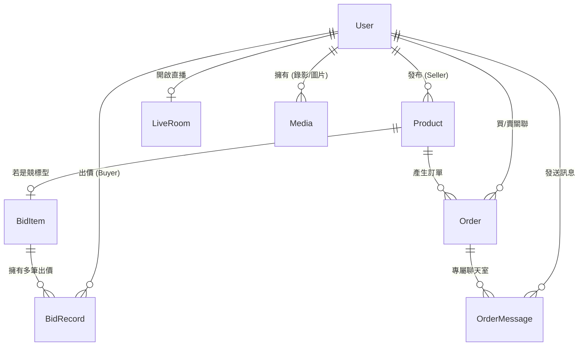

# 🐾 寵物live - Web 前後端系統詳細規格書 (v4.1 擴充版)

本文件為 **PetLive** 系統的最高指導原則。初期開發重心將全面放在「Web 前後端與系統基建」，以確保底層邏輯穩健、資料庫具備擴充性，並透過網頁端完美避開 APP 平台的 30% 抽成。

---

## 🗄️ 一、 詳細資料庫綱要 (Data Structure & ERD)

本系統基於 **Python Flask** 與 **PostgreSQL (Cloud SQL)** (或初期 MongoDB)，並使用 RESTful/WebSocket 作為核心。以下為核心實體關聯設計。

### 1. User (會員)
買賣家共用帳號。使用第三方登入時不需密碼。
| 欄位名稱 | 型別設定 | 說明與關聯 |
| :--- | :--- | :--- |
| `id` | String/UUID (PK) | 唯一識別碼 |
| `email` / `phone` | String (Unique) | 登入帳號聯絡方式 |
| `password` | String | 使用者密碼 (未來採 hash) |
| `role` | Enum | `BUYER` (買家), `SELLER` (賣家), `ADMIN` (管理員) |
| `is_test` | Boolean | 是否為測試帳號。`True` 允許管理員強制切換身分 |
| `credit_score` | Int | 信用分數，預設 `100`，滿分 `200` |

### 2. LiveRoom (直播間) & Media (多媒體/錄影)
紀錄直播與錄影儲存。
| 欄位名稱 | 型別設定 | 說明與關聯 |
| :--- | :--- | :--- |
| `room_id` | UUID (PK) | 直播間編號 |
| `seller_id` | UUID (FK) | 直播主 `User.id` |
| `thumbnail_url` | String | 直播封面 (由前端 Canvas 每數分鐘自動擷取並上傳) |
| `status` | Enum | `LIVE` (直播中), `ENDED` (已結束) |

**Media 表 (包含 LIVE 錄影)**
| 欄位名稱 | 型別設定 | 說明與關聯 |
| :--- | :--- | :--- |
| `type` | Enum | `LIVE_RECORD` |
| `url` | String | 後端 `/uploads` 之相對路徑 |
| `status` | Enum | `PUBLIC` (公開展示), `PRIVATE` (僅自己可見) |

---

## 🖥️ 二、 Web 前端頁面與組件規劃 (React / Next.js)

### 1. 登入與註冊系統 (Auth)
- **註冊頁面 (`/register`)**：支援「手機」或「Email」雙軌驗證，需輸入驗證碼，註冊成功後建立帳號。
- **登入頁面 (`/login`)**：
  - 支援傳統帳密登入。
  - 內建 `Google` 與 `LINE` 第三方登入按鈕 (預留擴充)。
  - **嚴格防護**：訪客必須登入才能查看其他買賣家資訊與進入直播間。

### 2. 社群平台引流神器 (Social Media Generator)
專為賣家設計的導流工具，用於在 Facebook, Instagram (含限動), Threads 打廣告。
- **一鍵生成高質感圖卡**：系統自動將「直播封面/賣家頭像」加上「專屬 QR Code」及「寵BAR Logo」合成為圖片供賣家下載。
- **高轉換文案模板**：提供數組短文案與短網址，一鍵複製即可至各大社團與論壇貼文。

### 3. Live 互動直播模組 (Live Room)
- **WebRTC P2P 串流**：採用 PeerJS 進行連線，買家低延遲觀看。
- **直播端自動錄影**：
  - 賣家開啟直播時，前端同步啟動 `MediaRecorder` 進行錄製。
  - **自動分段**：為避免檔案過大，每 30 分鐘自動停止打包並上傳至後端，隨即重啟新錄影。
  - 結束直播時上傳最後一段影片。
- **即時封面更新**：賣家端每隔幾分鐘自動將 `<video>` 繪製至 `<canvas>` 並轉成圖片上傳，作為首頁直播列表的動態封面。

### 4. 會員中心 (Profile / Dashboard)
- **LIVE 錄影回放管理** (賣家專屬)：
  - 顯示所有自動上傳成功的歷史錄影清單。
  - 提供切換影片為 `PUBLIC` (公開給買家看) 或 `PRIVATE` (隱藏) 的開關，並支援「刪除」功能。
- **管理員專屬後門 (Admin Impersonation)**：
  - 若登入身分為 `ADMIN`，提供「📋 查詢測試帳密」按鈕，可查看所有 `is_test: true` 的帳號與明文密碼。
  - 管理員可強制登入任何測試帳號進行操作，並在畫面頂部顯示「🛠️ 管理員模式下切入 XXX」的全域紅色警示列。

---

## ⚙️ 三、 核心系統與資料流邏輯 (Business Logic Rules)

### 1. 錄影檔案管理 (Backend Storage)
- 後端建立 `/uploads` 目錄。
- 提供 `POST /api/live/upload-record` 接收 multipart form data，並寫入 `media` 表。
- 當影片被設定為 `PUBLIC` 時，其他買家進入該賣家的主頁時，可看見並回放這些精華片段。

### 2. 競標高併發防呆機制 (Redis Lock)
- 確保結標前大量出價的正確性，透過分散式鎖防止重複寫入。

### 3. 棄標懲罰機制 (自動與手動扣分)
- `is_abandoned` 標記為 True 時扣除信用分數 10 分。信用低於標準將限制未來出價。
